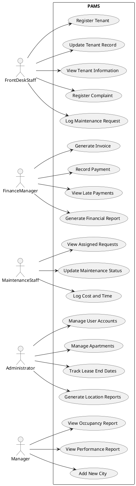
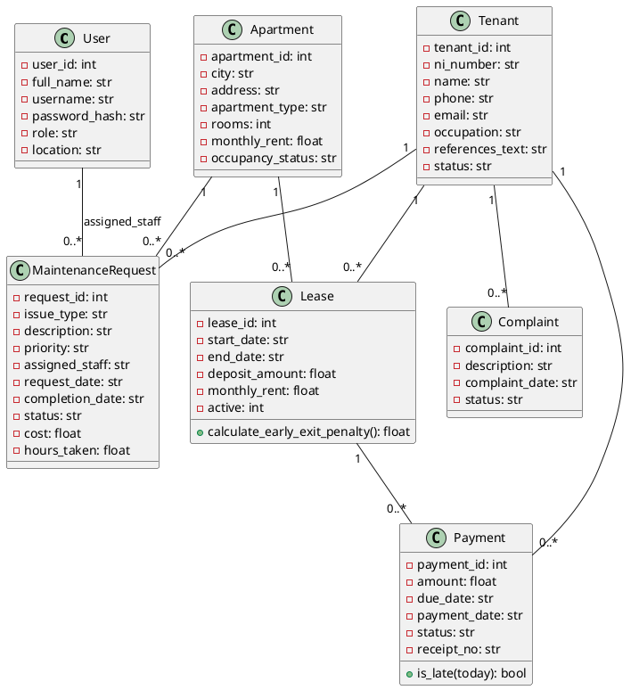
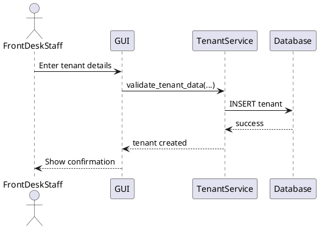
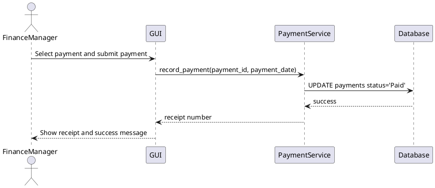
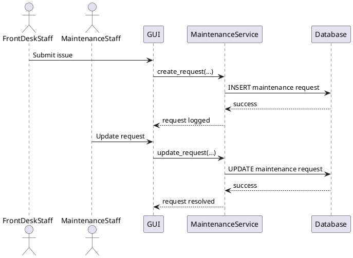

# PAMS UML Content

## Use Case Diagram (PlantUML)

## Class Diagram (PlantUML)

## Sequence Diagram 1: Register New Tenant

## Sequence Diagram 2: Record Rent Payment

## Sequence Diagram 3: Log and Resolve Maintenance Request

